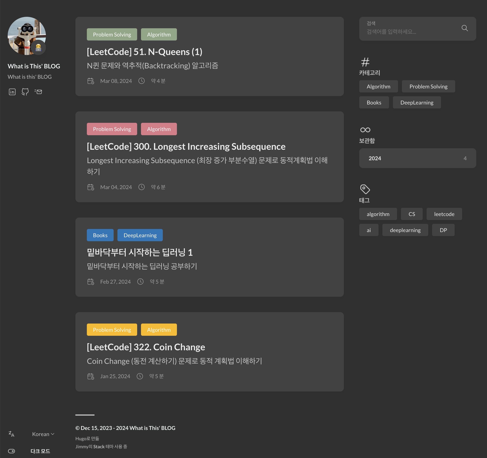

Gatsby 블로그 제작 과정을 보고싶으시면 시리즈의 [두번째 포스트](https://what-is-this-blog.netlify.app/making-gatsby-blog/)를 참조해주세요!

## 기술 블로그, 제작할 결심
   
2024, 올 해 목표에서 꼭 이루었으면 했던 것 중 하나가 '기술 블로그 만들기' 였습니다.

 초,중,고를 지나고 대학교까지 긴 시간을 보낸 후 졸업을 목전에 두니, 학생의 신분에서 벗어나서 나의 경쟁력을 키워야한다는 생각을 꾸준히 하게 되었습니다.
그 중에서 제 힘으로 ~~쉽게~~(전혀 쉽지 않았지만) 시작해볼 수 있는 것이 자취를 조금씩 남겨두는 것이라 생각했고, 그렇게 어떤 플랫폼에 과정을 담을까 고민했습니다.

저는 현재 *ML/AI 엔지니어* 를 직업적인 목표로 하고 있지만, 결국 이런 커리어의 궁극적인 목표는 사회적으로 도움이 되는 기술을 개발하고 싶다는 겁니다.
조금 더 자세한 정의가 필요해 보이는 목표인데요. 당장은 제가 만족할 분야를 찾아서 일을 하고싶습니다.
그렇다면, 현대 사회에서 가장 효과적인건 컴퓨터 프로그램을 만들 줄 아는 능력이고, 이 기술을 폭 넓게 이해할 수록 도움이 될 것이라고 생각했습니다.

결론은 그래서 직접 웹 페이지의 작동 원리를 이해하고, **가능하면 내가 직접** 블로그를 호스팅하고 싶다는 생각 끝에 이 페이지가 탄생한 것입니다.

------------------------
## 프레임워크 선택의 고군분투
   

직접 블로그를 제작해보고 싶으신 분들이 고려하고 계신 프레임워크 선택지가 아마 [`jekyll`](https://jekyllrb-ko.github.io/), [`hugo`](https://gohugo.io/), [`hexo`](https://hexo.io/ko/), [`gatsby`](https://www.gatsbyjs.com/) 가 있을겁니다.

> 여기서 프레임워크란건 쉽게 말해서 블로그를 쉽게 개발하기 위해 만들어둔 환경이라고 생각하시면 좋겠습니다.
제 블로그는 정적인 웹 페이지로, 미리 만들어진 페이지 정보를 불러오기만 하면 여러분들 화면에 뜨게 되는데 그걸 '미리 만들어주는' 역할을 해주는게 프레임워크입니다.
(엄밀한 정의는 아니고 이해를 위한 가벼운 설명입니다)

원래 저도 이 중에 어떤 기술을 이용해볼까 고민을 했었는데요, 돌이켜보니 결국 `hexo`를 제외하고 세가지를 한번씩 이용해보았습니다.

### Jekyll
 가장 처음 시도했던건 `jekyll`(지킬) + `github-pages`(깃허브 페이지) 조합입니다. 이건 무려 깃허브에서 공식적으로 지원하는 조합이라고 혹해서 제작에 들어갔습니다.
..만 제가 간과했던 건 지킬이라는 프레임워크의 구성 언어인 `ruby`(루비) 입니다.
 깃허브 웹페이지도 이 루비라는 언어를 이용한 웹 프레임워크로 구성되어있을 만큼 활용도가 높은 언어이지만, 문제는 **제가 안익숙하다는 점**입니다. 당장의 블로그 제작을 목표로 하고 있는데 언어가 이해가 안되니 개발 속도가 너무 느리다는 거였죠.
 그리고 당시에는 프레임워크 내부에 파일들 (yaml, html)이 어떤 역할을 하는지 조차 잘 이해가 안갔기 때문에 머리가 아팠습니다.

지금 생각해보면 더 도전할만 했겠지만 그떄는 조급해져서 테마를 적용하고 내부 정보를 바꾸다가 포기했습니다.

### Hugo
 다음에 시도했던게 `hugo`(휴고) + `github-pages`(깃허브 페이지) 조합입니다. 이건.. 당시에 `gatsby`가 그렇게 유명하다고 생각을 못했던 때라 지킬을 포기한 뒤 당연한 선택지었습니다.
휴고를 구성하는 언어는 [`go`](https://go.dev/doc/tutorial/getting-started) 입니다. go 언어는 구글에서 개발한 언어인데, 루비에 데이고(?) 나서 이 언어는 더 공부해봐야겠다! 생각으로 호기롭게 시작했습니다.

이걸 만들면서 html, css, go, markdown, toml, yaml 등등 다양한 개념들과,
언어들에 부딫혀볼 수 있었고, 웹 페이지를 호스팅하는 과정 자체도 어느정도 이해할 수 있었습니다.
\
\
그렇다면 왜 이 페이지는 `gatsby`로..?
네, 이번에 간과했던 사실은 <mark>**블로그는 꾸준히 써야 한다는 점입니다.**</mark>

올 초, 열정에 불타서 블로그를 만든 뒤에 딥러닝, 알고리즘 공부한 내용도 적고, 몇 포스트 올리는가 싶다가...
중간에 막학기가 시작했다는 핑계로 미루고 미루다 결국 졸업 때 까지 포스팅을 못했습니다.
문제는 졸업 이후 맥북이 돌연사...하는 바람에 내부 데이터가 싹 날아갔고, hugo 프레임워크로 포스팅 한 html외에 작업물을 어디에도 백업을 안해뒀다는 사실을 깨닫습니다 😱
(모두 백업을 생활화 합시다ㅠ)

그 뒤로 다시 기존 블로그를 살리기 위해 시도했으나, 블로그 테마였던 [stack-theme](https://stack.jimmycai.com/)을 수정하는 과정에서 오류가 자꾸 나는 바람에 싹 뒤엎고 다시 만들기로 결심합니다!

### Gatsby
 마지막 시도는 `Gatsby` 프레임워크입니다. 새로 시작하더라도 hugo로 제작하는 편이 물론 쉬웠을 것 같긴 하지만, 이번에 제 목표는 좀 더 확고했습니다.
 이제 겉핥기로만 알지 말고, 동작 원리를 정확히 이해하고 내가 파고들어 수정할 수 있도록 하자. 그리고 마침 올해 10월에 React를 접할 일이 생겼습니다.
 Google-NIPA 연계 실무 부트캠프를 진행하던 중, Streamlit(파이썬 기반 웹페이지 호스팅)으로 대쉬보드를 만들면서 React 컴포넌트를 제작해보게 된 것이죠.

여기서 리액트와 자바스크립트를 잠깐 경험하고 자신감이 생긴 저는, 자바 스크립트를 기반으로 하는 프레임워크인 `gatsby`로 블로그를 제작해보기로 결심합니다.

어떻게 만들었는지는 시리즈 2편으로~

**to be continued...**