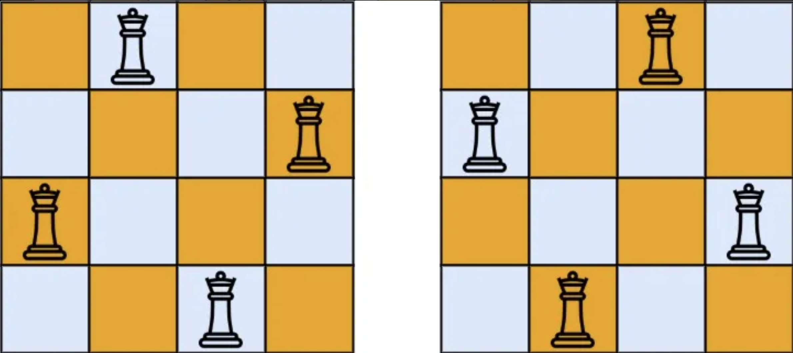

## 문제 소개

**리트코드 원본 문제 : [(리트코드 사이트)](https://leetcode.com/problems/n-queens/description/)**

> The n-queens puzzle is the problem of placing n queens on an n x n chessboard such that no two queens attack each other.
>
>
> Given an integer n, return all distinct solutions to the n-queens puzzle. You may return the answer in any order.
>
> Each solution contains a distinct board configuration of the n-queens’ placement, where ‘Q’ and ‘.’ both indicate a queen and an empty space, respectively.
>

한국어로 번역해보자면,

> n-퀸 퍼즐은 여왕들이 서로 공격하지 않도록 n x n 짜리 체스판에 n개의 여왕을 배치하는 문제이다. 정수 n이 주어졌을 때, 가능한 모든 해를 반환하며 해답의 순서는 상관 없다. 각 해는 n개의 여왕을 배치할 수 있는 보드의 구성을 포함해야 하며 ‘Q’는 여왕, ‘.‘는 빈칸을 나타낸다.
>

이 문제는 제시문 자체를 이해하는 것이 어렵기 때문에 설명을 조금 덧붙이자면, 입력값은 단순하게 n = 3 이나, n = 4 등 간단한 정수를 입력으로 받게 되고, 우리는 이 n에 따른 n x n 짜리 체스판이 있다고 가정하는 겁니다. 그 체스판 안에 n개의 퀸의 경로가 겹치지 않도록 배치도를 반환하는 문제인 것이죠. 문제 설명에 제시된 예시를 한번 보자면,

> 입력값: n = 4 출력값: [[".Q..","...Q","Q...","..Q."],["..Q.","Q...","...Q",".Q.."]]
>

아래는 입력값 `n = 4` 일 때 출력값을 시각화 하여 보여준 그림입니다. 즉, 출력의 각 원소는 하나의 n x n 짜리 체스판을 나타내고, 체스판 내의 각 원소는 위에서부터 가로로 (또는 세로로도 읽을 수 있습니다) **한 줄**씩 나타낸 값이 됩니다.



`n = 4` 일 경우에는 위의 두가지 답 외에는 퀸을 놓을 수 있는 방법이 없습니다. 이런 문제를 어떻게 하면 풀 수 있을까요?

## 접근법

### 역추적 알고리즘

오늘 이 문제와 연관된 키워드는 **역추적(Backtracking) 알고리즘** 입니다. 그렇다면 역추적 알고리즘이 무엇인지 위키에서 살펴봅시다. 위키는 Backtracking을 ‘퇴각검색’으로 번역합니다.

> 퇴각검색(영어: backtracking, 한국어: 백트래킹)은 한정 조건을 가진 문제를 풀려는 전략이다. 문제가 한정 조건을 가진 경우 원소의 순서는 해결 방법과 무관하다. 이런 문제는 변수 집합으로 이뤄지는데, 한정 조건을 구성하려면 각각의 변수들은 값이 있어야 한다. 퇴각검색은 모든 조합을 시도해서 문제의 해를 찾는다. 이것이 장점이 될 수 있는 이유는 퇴각검색 구현 방법들이 많은 부분 조합들을 배제하기 때문이다. 결국 풀이 시간이 단축된다. (출처: 위키피디아)

설명이 너무 어려운 것 같네요ㅠ. 일단 지금 중요한 부분만 뽑아 굵은 글씨로 표시해두었습니다. 말 그대로 주어진 모든 조합을 시도해서 해를 찾는데, 이를 구현하는 방법에서 부분 조합들을 베제하기 때문에 풀이가 빨라진다~ 정도로 이해하면 되겠습니다.
반복을 줄이는 방법에도 여러가지 유형이 있지만, 거기까진 다루지 않겠습니다.

일단 구현하는 아주 기본적인 프레임을 의사코드로 확인해보죠:

```
def backtrack(경로, 선택 리스트):
    if 종료 조건 만족시: 
        result.add(경로)
    return

    for 선택 in 선택 리스트:
        퀸을 특정 위치에 놓기 # 선택
        backtrack(경로, 선택 리스트)
        놓았던 퀸 제거하기 # 해제
```

위 코드를 잠깐 생각해 봅시다.  
여기서 **'선택'** 은 특정 위치에 퀸을 놓는 것이고, **'해제'** 는 놓았던 퀸을 제거하는 것입니다. 각 행마다 퀸을 하나씩 놓아보고, 
만약 그 선택이 올바르지 않다면(다른 퀸과 충돌이 발생한다면) 해당 선택을 취소하고 다른 위치를 시도하는 것이죠.

### 알고리즘을 적용한 문제풀이

다시 문제로 돌아옵시다.  
결국 우리는 이번 N-Queens 문제를 역추적 알고리즘을 이용하여 푸는 것이 핵심입니다.

바로 backtrack을 적용하면 좋겠지만, 그 전에 완성해야할 두가지 요소가 있습니다.
1. 체스판 구현 : 입력으로 받을 비어있는 체스판 구현
2. 유효성 검사 함수 구현 : 퀸이 유효한 위치에 있는지 확인

#### 리스트로 체스판 구현하기

먼저 체스판 부터 구현하죠!  
리트코드 문제에서 요구하듯이, 출력 형식이 문자열 리스트로 되어있으므로 이를 빌려오면 좋을것 같습니다.
비어있는 보드판을 생각해보면 행의 상태를 "...."와 같은 문자열로 표현하면 퀸의 위치를 쉽게 표시하고 확인할 수 있겠네요! 이를 n * n 개의 보드판에도 적용할 수 있게 짜봅시다.

`board = ["."*n for i in range(n)]`

이렇게 구성하면 n = 4 일 때 ["....","....","....","...."]이 되겠네요. 각 "."은 빈 칸을, "Q"는 퀸의 위치를 나타내게 됩니다. 퀸을 놓거나 제거할 때는 문자열 슬라이싱을 사용해 해당 행의 문자열을 새것으로 교체합니다.
```
# 퀸을 놓을 때
board[row] = board[row][:col] + "Q" + board[row][1+col:]
# 퀸을 제거할 때
board[row] = board[row][:col] + "." + board[row][1+col:]
```

그럼 빈 체스판이 완성되었네요 :D

#### 유효성 검사 함수 구현

> 체스판 만드는건 이해가 되는데 유효성 검사는 뭐야?

네, 저희 의사 코드에서 "특정 위치에 놓기" 라고 아주 뭉뚱그려 넘어갔던 그 부분입니다. _**제가 새로이 놓는 퀸은 다른 퀸과 충돌하면 안됩니다.**_  
즉, 새로 놓은 퀸이 잘 놓은 퀸인지 아닌지를 확인할 필요가 있습니다. 이걸 위한 함수가 유효성 검사 함수 `isValid()` 함수입니다.  
여기서 핵심적인 제약조건은 "어떤 두 퀸도 서로를 공격할 수 없어야 한다"입니다. 퀸은 가로, 세로, 대각선 방향으로 이동할 수 있으므로, 새로운 퀸을 놓을 때마다 이 세 방향을 모두 검사해야 합니다.

```
def isValid(board, row, col):
    # 세로 방향 검사
    for i in range(row):
        if board[i][col] == "Q":
            return False
    
    # 오른쪽 위 대각선 검사
    for i, j in zip(range(row - 1, -1, -1), range(col + 1, len(board), 1)):
        if board[i][j] == "Q":
            return False
    
    # 왼쪽 위 대각선 검사
    for i, j in zip(range(row - 1, -1, -1), range(col - 1, -1, -1)):
        if board[i][j] == "Q":
            return False
    return True
```
#### 구현 코드 합치기

필요한 모든 요소들은 구현이 되었습니다. 이제 이 요소들을 합치기만 하면 됩니다.

```
# 최종 구현 코드
class Solution(object):
    def solveNQueens(self, n):
        res = []
        board = ["."*n for i in range(n)]
        
        def backtrack(board, row):
            nonlocal res
            if row == len(board):
                res.append(board[:])
                return

            for col in range(len(board)):
                if isValid(board, row, col) == False:
                    continue
                board[row] = board[row][:col] + "Q" + board[row][1+col:]
                backtrack(board, row + 1)
                board[row] = board[row][:col] + "." + board[row][1+col:]
            
        def isValid(board, row, col):
            # 세로 방향 검사
            for i in range(row):
                if board[i][col] == "Q":
                    return False
            
            # 오른쪽 위 대각선 검사
            for i, j in zip(range(row - 1, -1, -1), range(col + 1, len(board), 1)):
                if board[i][j] == "Q":
                    return False
            
            # 왼쪽 위 대각선 검사
            for i, j in zip(range(row - 1, -1, -1), range(col - 1, -1, -1)):
                if board[i][j] == "Q":
                    return False
            return True

        backtrack(board, 0)
        return res
```


해당 PS 풀이는 도서 [[코딩 인터뷰를 위한 알고리즘 치트시트, 푸둥라이 지음]](https://product.kyobobook.co.kr/detail/S000061898577)을 참고하며 진행중임을 밝힙니다.