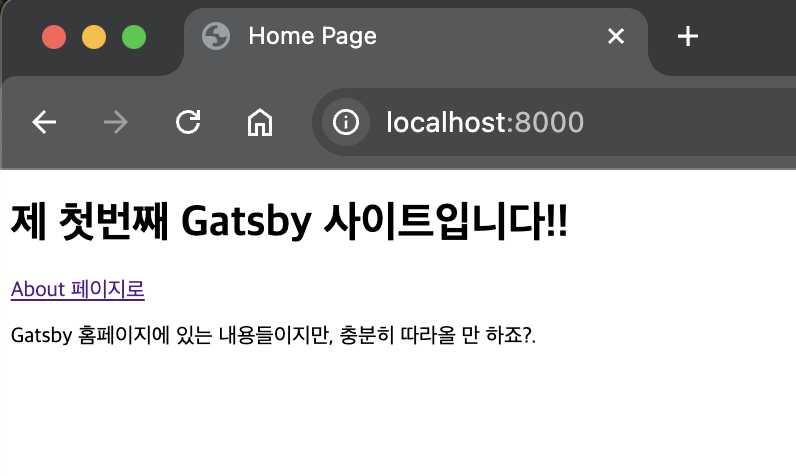
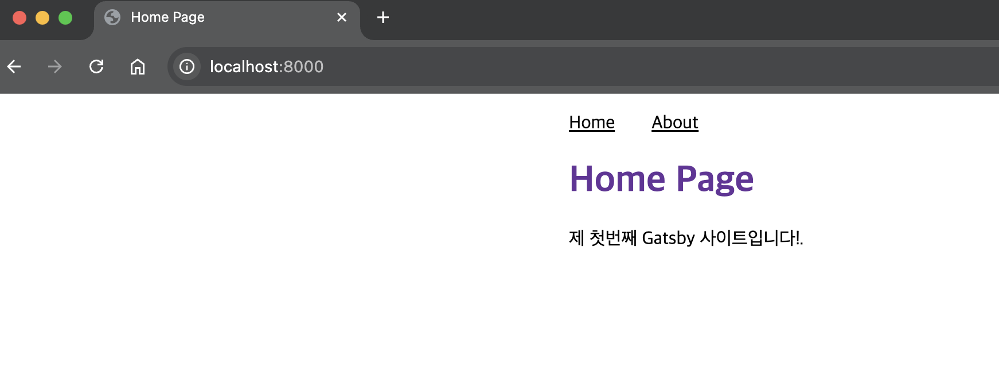

해당 글은 제가 gatsby 문서\[[gatsby-getting-started](https://www.gatsbyjs.com/docs/tutorial/getting-started/part-0/)]를 바탕으로 진행한 내용입니다. 보다 전문적이고, 확실한 내용은 해당 링크를 참조하세요!

## Gatsby 사이트 만들어보기

전 편에서 준비물이 모두 세팅이 끝났다면, 직접 Gatsby를 이용한 사이트를 하나 제작해봅시다!
(튜토리얼을 진행하시면서 gatsby가 어떤 구조로 이뤄졌는지 익히는 편이 좋을 것 같으니 너무 공들여 진행하지 말고 바로바로 따라가는걸 추천합니다.)

### $ gatsby new
먼저, 우리는 `gatsby new`를 이용해서 웹사이트 내용이 들어갈 폴더를 하나 생성할 겁니다.
이 명령어를 실행하면 추후 지시사항을 따라서 하위 폴더가 생성될 예정이니, 유의해서 터미널을 실행해봅시다.

다시 말해, Desktop/ 경로의 하위 폴더에 블로그 내용을 만들고 싶다면, 아래와 같이

```shell
cd Desktop/ # 바탕화면으로 이동
gatsby new # 명령어 실행
```

명령을 통해서 사이트 제작을 진행하면 되겠습니다!

`gatsby new` 명령어를 치셨다면 프롬프트에 아래와 같은 내용이 나올겁니다.

```shell
What would you like to call your site?
✔ · My First Gatsby Site ## 이건 예시입니다. 사이트 이름을 입력하세요 (메인 페이지 접속시 타이틀이 됩니다)
```

```shell
What would you like to name the folder where your site will be created?
✔ Desktop/ my-first-gatsby-site # 이 이름이 폴더 이름이 될 예정입니다(되도록 띄어쓰기 없이 영어로 써야 오류가 안납니다)
```

`Will you be using JavaScript or TypeScript?` 를 묻는 질문에는
자바스크립트 or 타입스크립트의 경우 더 친숙한 형태로 선택하시고(저는 튜토리얼 권장대로 자바스크립트를 진행했습니다.),

`Will you be using a CMS?` CMS는 (Contents Management System) 을 묻는 것 같은데 일단
No (or I'll add it later)로 답변합니다.

`Would you like to install a styling system?` 이것도 지금 튜토리얼에선 스킵합니다.
· No (or I'll add it later)

`✔ Would you like to install additional features with other plugins?` 이 역시 일단은 스킵.
· Done

모든 질문에 답했다면 마지막으로 정리해서 물어보는 프롬프트가 나옵니다:

```shell
Thanks! Here's what we'll now do:

    🛠  Create a new Gatsby site in the folder my-first-gatsby-site # 여기 내용은 위 폴더 이름에 따라 다를 수 있습니다
? Shall we do this? (Y/n) › Yes
```

여기서 Y를 입력해서 실행하고 잠시 기다리면 gatsby cli에 의해서 자동으로 뚝딱뚝딱 첫 사이트를 세팅해줍니다! 무사히 잘 마쳤다면 아래와 같은 프롬프트가 나올겁니다.

```shell
🎉  Your new Gatsby site My First Gatsby Site has been successfully
created at ~/Desktop/my-first-gatsby-site.
Start by going to the directory with

  cd my-first-gatsby-site

Start the local development server with

  npm run develop

See all commands at

  https://www.gatsbyjs.com/docs/gatsby-cli/
```

이제 이 사이트를 로컬(인터넷 사이트가 아닌 가지고 있는 컴퓨터)에서 구동해봅시다!

먼저 `cd` 명령어를 이용해 아까 만든 폴더로 이동해줍시다.

```shell
cd Desktop/my-first-gatsby-site # 이 경로, 이 폴더가 아닌 다른 경로에 다른 이름으로 폴더를 만들었다면 해당 경로로 이동해주시면 됩니다.
```
이제 이 gatsby 사이트 내용이 담긴 폴더에서 `gatsby develop` 명령어를 실행하면,

```shell
gatsby develop #혹시 gatsby cli가 global로 설치되지 않았을 경우에는 npm run develop 을 사용해도 됩니다.
```

처음 실행 될 때는 조금 걸릴겁니다. 성공적으로 페이지를 잘 실행이 되었다면, 아래와 같은 프롬프트를 볼 수 있습니다!

```shell
You can now view my-first-gatsby-site in the browser. ## 이름 역시 제가 세팅해놓은 이름으로 바뀝니다!
⠀
  http://localhost:8000/
⠀
View GraphiQL, an in-browser IDE, to explore your site's data and
schema
⠀
  http://localhost:8000/___graphql
```

이제 `http://localhost:8000/` 로 가봅시다. 성공적으로 Gatsby 페이지가 반겨줄겁니다!!ㅎㅎ


...그래서 이제 뭘 하냐구요? 지금은 정말 '아무' 내용도 없는 빈 사이트이므로, gatsby에서 제공한 빈 페이지 양식의 사이트가 보이는 겁니다. 이제 이걸 채우는게 저희 목표겠죠.


Gatsby의 핵심 메커니즘을 이해하기 위해 빠르게 페이지를 하나 제작해봅시다!

### 첫 페이지

지금 생성된 my-first-gatsby-site 폴더 내에는 웹사이트 제작을 담당하는 부분과, 사용자가 임의로 설정/추가 해야하는 부분들이 섞여있습니다.
다시 말해, '웹 프레임워크'로써의 기능을 위한 파일들과, 사용자가 조작해서 커스터마이징하는 부분으로 나뉘어 있는데요.
지금 우리가 첫번째로 건드릴 요소는 `src/pages/index.js` 파일입니다.

vscode와 같은 코드 에디터를 이용해서 해당 파일 내용을 아래 코드로 교체해봅시다.

```javascript
// Step 1: Import React
import * as React from 'react'

// Step 2: Define your component
const IndexPage = () => {
  return (
    <main>
      <h1>제 첫번째 Gatsby 사이트입니다!!</h1>
      <p> Gatsby 홈페이지에 있는 내용들이지만, 충분히 따라올 만 하죠?.</p>
    </main>
  )
}

// 이건 사이트의 메타데이터를 위한 장치입니다.
export const Head = () => <title>Home Page</title>

// Step 3: Export your component
export default IndexPage
```

이렇게 세팅하고 `localhost:8000` 을 확인해보면, 아주 구린 글씨체와(아마도 times new roman 비슷한) 저희가 적은 간단한 내용의 글이 떡하니 적혀있을 겁니다.

👏 성공적으로 저희가 원하는 내용(?)의 사이트를 띄우는데 성공했습니다!

### 두 번째 페이지

모름지기 웹사이트는 적어도 두 페이지 정도는 있어야 하는 법. 이제 두번째, About 페이지를 만들어보고 첫 페이지와 연동시켜봅시다.
일단 새로운 파일을 만들어야합니다. `about.js`파일을 `src/pages/` 폴더에 만들어줍시다.

비어있는 `about.js` 파일을 아래 내용으로 채워줍시다.
```javascript
// Step 1: Import React
import * as React from 'react'

// Step 2: Define your component
const AboutPage = () => {
  return (
    <main>
      <h1>About Me</h1>
      <p> 제 이름은 Gatsby 입니다!</p>
    </main>
  )
}

// Step 3: Export your component
export default AboutPage
```

자 이제 해당하는 파일은 `localhost:8000/about` 을 브라우저창에 검색하면 확인할 수 있습니다. 매번 이 파일을 직접 쳐서 볼 수는 없으니 페이지를 연결(link)해 봅시다.

먼저, `src/pages/index.js` 파일 내용을 바꿉시다.

```javascript
import * as React from 'react'
import { Link } from 'gatsby'

const IndexPage = () => {
  return (
    <main>
      <h1>제 첫번째 Gatsby 사이트입니다!!</h1>
      <Link to="/about">About 페이지로</Link>
      <p> Gatsby 홈페이지에 있는 내용들이지만, 충분히 따라올 만 하죠?.</p>
    </main>
  )
}

export const Head = () => <title>Home Page</title>

export default IndexPage
```

그리고 `src/pages/about.js` 파일도 바꿔봅시다.

```javascript
import * as React from 'react'
import { Link } from 'gatsby'

const AboutPage = () => {
  return (
    <main>
      <h1>About Me</h1>
      <Link to="/">홈 페이지로</Link>
      <p> 제 이름은 Gatsby 입니다!</p>
    </main>
  )
}

export const Head = () => <title>About Me</title>

export default AboutPage
```

자, 여전히 레이아웃은 멋없지만, 그래도 두 페이지가 잘 작동하는 웹 사이트가 만들어졌습니다! 정말 핵심적인 기능만을 구현한 상태의 웹사이트라고 생각하면 되겠네요.



### 스타일링

멋을 추가하려면 css 파일을 만들어 설정해주면 됩니다. gatsby는 기본적으로 각 이름에 맞추어 기능을 수행하도록 미리 설정이 되어있습니다.
이번엔 `\pages` 폴더가 아닌  `src/` 폴더 내에 `components`라는 폴더를 만들어주고, 레이아웃을 설정해줄 `layout.module.css` 라는 css파일을 만들어줍시다.
```css
.container {
  margin: auto;
  max-width: 500px;
  font-family: sans-serif;
}

.heading {
  color: rebeccapurple;
}
.nav-links {
  display: flex;
  list-style: none;
  padding-left: 0;
}
.nav-link-item {
  padding-right: 2rem;
}
.nav-link-text {
  color: black;
}
```

이 css 클래스들이 적용될 수 있도록 Layout이라는 컴포넌트를 만들어 임포트 합시다. (하나의 페이지만 적용하는 것이 아니라, 전체 레이아웃에 적용할 수 있도록 새로운 js파일을 별도로 만든겁니다.)
먼저, `src/components` 폴더 내에 `layout.js` 파일을 만듭니다.

내용은 아래와 같이 붙여넣어 줍시다.
```javascript
import * as React from 'react'
import { Link } from 'gatsby'
import {
  container,
  heading,
  navLinks,
  navLinkItem,
  navLinkText
} from './layout.module.css'

const Layout = ({ pageTitle, children }) => {
  return (
    <div className={container}>
      <nav>
        <ul className={navLinks}>
          <li className={navLinkItem}>
            <Link to="/" className={navLinkText}>
              Home
            </Link>
          </li>
          <li className={navLinkItem}>
            <Link to="/about" className={navLinkText}>
              About
            </Link>
          </li>
        </ul>
      </nav>
      <main>
        <h1 className={heading}>{pageTitle}</h1>
        {children}
      </main>
    </div>
  )
}

export default Layout
```

이제 마지막 단계가 남았습니다. 바로 기존 `src/pages/index.js` 와 `about.js` 내에 layout 컴포넌트를 불러와야죠.

`src/pages/index.js`
```javascript
import * as React from 'react'
import Layout from '../components/layout'

const IndexPage = () => {
  return (
    <Layout pageTitle="Home Page">
      <p>제 첫번째 Gatsby 사이트입니다!.</p>
    </Layout>
  )
}

export const Head = () => <title>Home Page</title>

export default IndexPage
```

`src/pages/about.js`
```javascript
import * as React from 'react'
import Layout from '../components/layout'

const AboutPage = () => {
  return (
    <Layout pageTitle="About Me">
      <p>저를 소개하죠. 제 이름은 Gatsby 입니다! </p>
    </Layout>
  )
}

export const Head = () => <title>About Me</title>

export default AboutPage
```

기존 코드에서 크게 두가지가 변한것을 확인할 수 있습니다.

`import Layout from '../components/layout'` 와, `<Layout></Layout>` 부분입니다. 차례대로 이 Layout이라는 컴포넌트를 불러와서, 내용을 덧씌운다는 의미죠.(이번 경우는 스타일을요)

이제 이 페이지를 확인하기 위해서는 다시 터미널(쉘)에서 서버를 다시 구동시켜주어야 합니다.
지금 npm서버가 작동하고 있는 터미널에서 `ctrl+c` 를 눌러 서버를 중지하고, 다시 `gatsby develop` 을 쳐서 서버를 구동한 뒤, `localhost:8000` 페이지를 확인해주세요!



이젠 페이지 내용이 중앙으로 정렬되기 때문에 위 사진처럼 보일겁니다.


### 마무리하며

이 튜토리얼 잠깐으로 알 수 있는 내용을 정리해봅시다.

우선, gatsby에서 사이트를 작동시키는 언어는 javascript입니다.(물론 typescript도 지원합니다).
특히, `src/pages` 내에 있는 자바스크립트 파일들을 수정하여 원하는 기능을 하는 페이지를 생성할 수 있었습니다. 그리고 페이지끼리 연결(link)하는 것은 `<Link to="/"></Link>`만 쓰면 됩니다.
`src/components` 폴더를 만들고, 안에 layout.js 파일과 css파일을 통해서 페이지 내 내용들의 스타일링도 변경할 수 있었습니다.

기본 구성에 대해서 조금 자세히 들어가 보자면, Gatsby의 기본 디자인 원리가 리액트의 방식에서 크게 영감을 받은 듯 보입니다. 사이트의 각 기능 요소들을 '컴포넌트'로 구분 짓고, 해당 컴포넌트를 불러오는 식으로 기능을 구현하도록 되어있습니다.
즉, 리액트가 대세인 ~(듯 한?)~ 요즘 프론트엔드 개발자 분들은 시도해보기 좋은 도구라는 생각이 듭니다!
.

원래 목적이 Gatsby의 튜토리얼을 전부 따라하는 것이 아니라, 이 블로그를 어떻게 제작했는가를 따라가보기 위한 수단으로써 시작한 튜토리얼이라
필요 이상으로 길어지는 듯 해서 이만 잠깐 중단하고, 본래 머신러닝/AI 분야 공부 내용을 올리도록 할게요 :) (기회가 되면 Graphql과 starter-blog 적용까지는 다뤄보겠습니다!)

